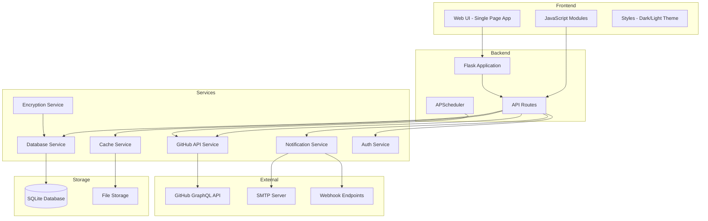
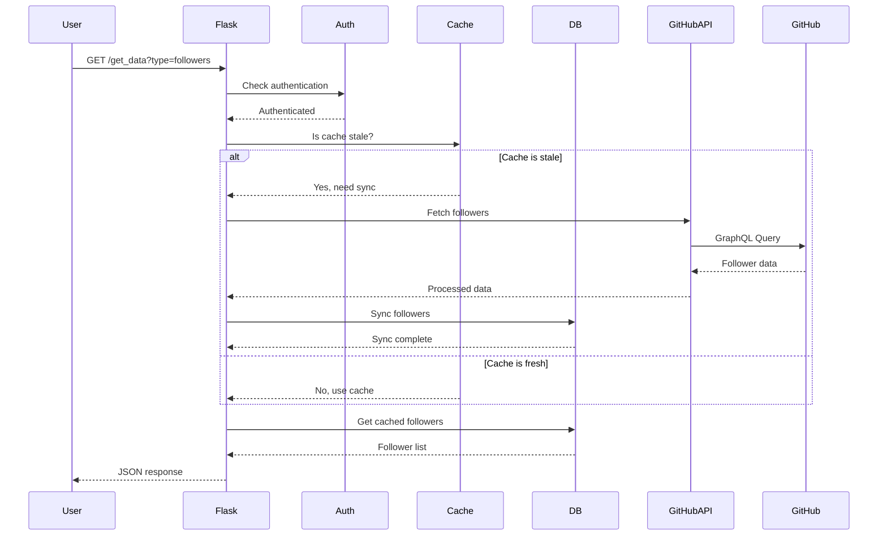
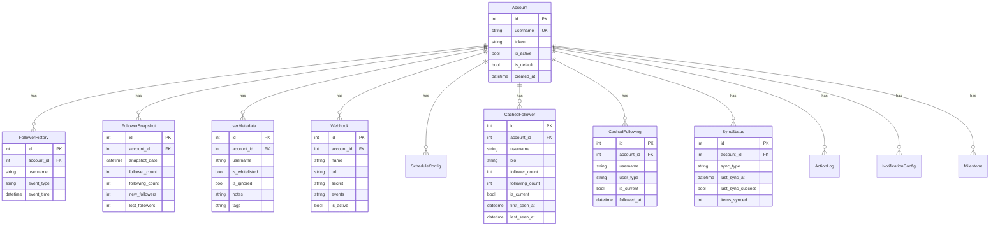
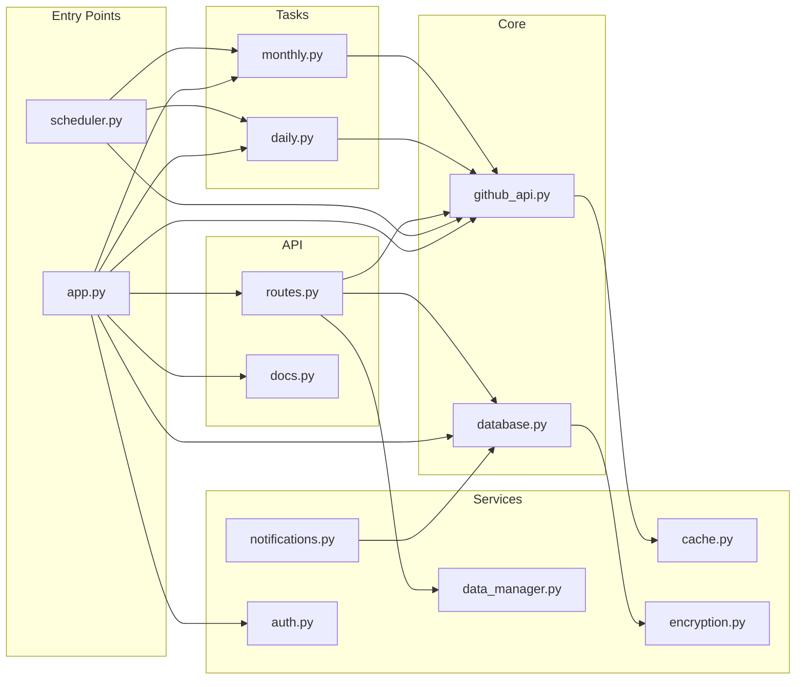
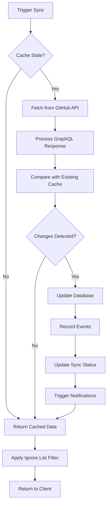
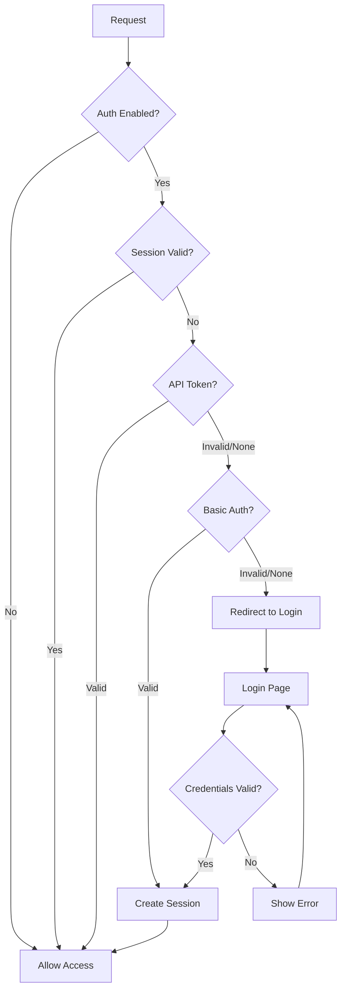

# Architecture Documentation

This document provides a detailed overview of the GitHub Followers Tracker architecture.

## System Overview



## Component Architecture

### Request Flow



### Database Schema



### Module Dependencies



## Data Flow

### Sync Process



### Authentication Flow



## Directory Structure

```
github-followers-tracker/
├── app.py                    # Main Flask application
├── scheduler.py              # Standalone scheduler
├── alembic.ini              # Database migration config
├── pyproject.toml           # Project configuration
├── pytest.ini               # Test configuration
├── requirements.txt         # Production dependencies
├── requirements-dev.txt     # Development dependencies
├── .pre-commit-config.yaml  # Pre-commit hooks
│
├── src/
│   ├── core/
│   │   ├── github_api.py    # GitHub API interactions
│   │   └── database.py      # SQLAlchemy models & operations
│   │
│   ├── services/
│   │   ├── auth.py          # Authentication service
│   │   ├── cache.py         # Caching utilities
│   │   ├── data_manager.py  # File-based data persistence
│   │   ├── encryption.py    # Encryption for sensitive data
│   │   └── notifications.py # Webhooks & email notifications
│   │
│   ├── tasks/
│   │   ├── daily.py         # Daily scheduled tasks
│   │   └── monthly.py       # Monthly scheduled tasks
│   │
│   └── api/
│       ├── routes.py        # Extended API endpoints
│       └── docs.py          # OpenAPI documentation
│
├── migrations/
│   ├── env.py               # Alembic environment
│   ├── script.py.mako       # Migration template
│   └── versions/            # Migration files
│
├── static/
│   ├── js/
│   │   ├── main.js          # Application entry point
│   │   ├── api.js           # API client
│   │   ├── ui.js            # UI components
│   │   ├── charts.js        # Analytics charts
│   │   └── utils.js         # Utility functions
│   ├── script.js            # Legacy JavaScript (deprecated)
│   └── styles.css           # Application styles
│
├── templates/
│   └── index.html           # Main template
│
├── tests/
│   ├── conftest.py          # Pytest fixtures
│   ├── test_github_api.py   # GitHub API tests
│   ├── test_database.py     # Database tests
│   └── test_routes.py       # API route tests
│
└── data/
    ├── github_tracker.db    # SQLite database
    ├── ignore_list.txt      # User ignore list
    └── .encryption_key      # Encryption key (gitignored)
```

## Key Design Decisions

### 1. GraphQL over REST
- More efficient data fetching (get exactly what we need)
- Fewer API calls (batch multiple queries)
- Better rate limit utilization

### 2. SQLite with WAL Mode
- No external database dependency
- WAL mode enables concurrent reads
- Portable - single file database

### 3. Database-backed Cache
- Persistent across restarts
- Queryable (unlike file cache)
- Supports complex filtering

### 4. Event Sourcing for History
- Complete audit trail
- Easy analytics generation
- Supports undo operations

### 5. Optional Authentication
- Disabled by default (localhost use)
- Environment variable configuration
- Session + API token support

## Performance Considerations

### Rate Limiting
- 100ms minimum between requests
- Exponential backoff on failures
- Rate limit cache (60s TTL)

### Connection Pooling
- 10 pool connections
- 20 max pool size
- Pre-ping connection validation

### Caching Strategy
- 15-minute sync interval
- Staleness detection
- Manual refresh available

### Database Optimization
- Strategic indexes
- 64MB query cache
- Batch inserts for sync
